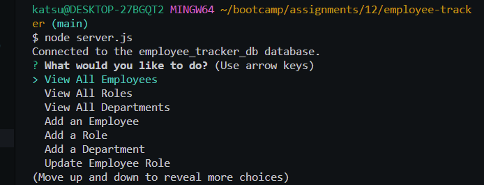

# 12 SQL: Employee Tracker

## Description

A backened server database to make get, post, put and delete requests in order to track employee data.

## Installation

Use node.js to install using "npm i" in terminal

## Usage

In the terminal run "npm start" and follow prompts

    
    
## Future Development

To add update and delete functions to db